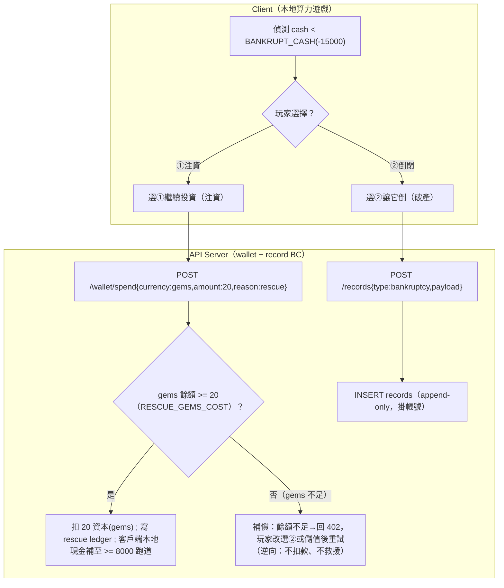

# Activity Diagram — 破產補償/救援流程（Exception/Compensation）

> 來源：EDD.md §4.5.7.3

```mermaid
flowchart TD
    subgraph Client ["Client（本地算力遊戲）"]
        C1["偵測 cash < BANKRUPT_CASH(-15000)"]
        C2{"玩家選擇？"}
        C3["選①繼續投資（注資）"]
        C4["選②讓它倒（破產）"]
    end
    subgraph API ["API Server（wallet + record BC）"]
        B1["POST /wallet/spend{currency:gems,amount:20,reason:rescue}"]
        B2{"gems 餘額 >= 20（RESCUE_GEMS_COST）？"}
        B3["扣 20 資本(gems) ; 寫 rescue ledger ; 客戶端本地現金補至 >= 8000 跑道"]
        B4["POST /records{type:bankruptcy,payload}"]
        B5["INSERT records（append-only，掛帳號）"]
        RB["補償：餘額不足→回 402，玩家改選②或儲值後重試（逆向：不扣款、不救援）"]
    end
    C1 --> C2
    C2 -->|"①注資"| C3 --> B1 --> B2
    B2 -->|"是"| B3
    B2 -->|"否（gems 不足）"| RB
    C2 -->|"②倒閉"| C4 --> B4 --> B5
```

> **補償執行語意**：`Choreography`（事件驅動）——破產記錄與救援扣款為各自獨立交易；救援扣款失敗（402）時逆向為「不扣款、不補現金」，玩家可改選倒閉或先儲值，不產生半筆異動。
