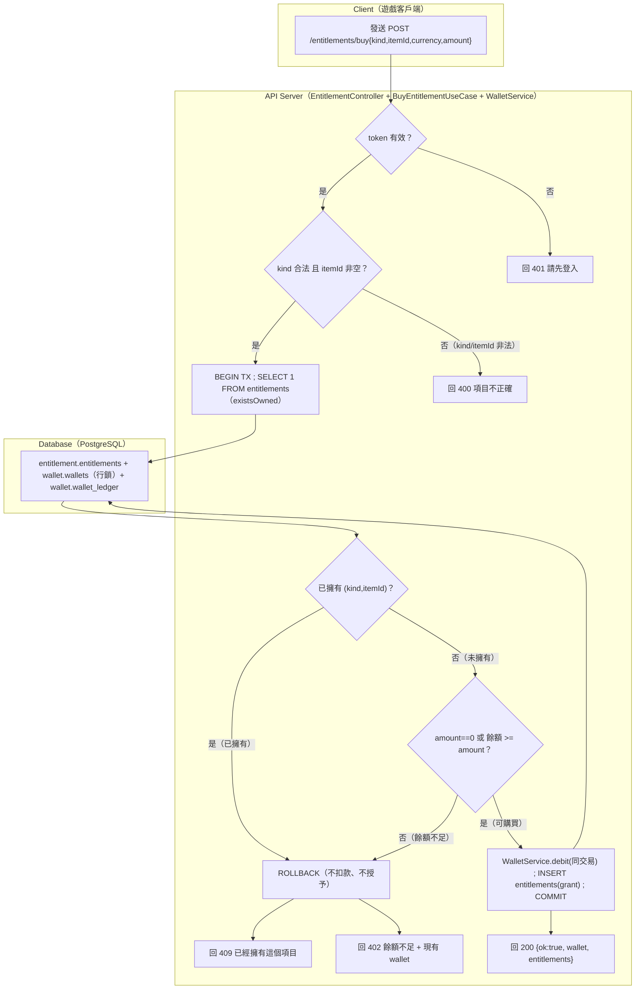

# Activity Diagram — 購買權益（跨模組原子扣款 + 授予）

> 推斷來源：EDD.md §4.5.4.3（Sequence）+ §4.5.6（3）Entitlement 狀態機 + PRD §5.3 AC-1~4

```mermaid
flowchart TD
    subgraph Client ["Client（遊戲客戶端）"]
        A1["發送 POST /entitlements/buy{kind,itemId,currency,amount}"]
    end
    subgraph API ["API Server（EntitlementController + BuyEntitlementUseCase + WalletService）"]
        B0{"token 有效？"}
        B1{"kind 合法 且 itemId 非空？"}
        B2["BEGIN TX ; SELECT 1 FROM entitlements（existsOwned）"]
        B3{"已擁有 (kind,itemId)？"}
        B4{"amount==0 或 餘額 >= amount？"}
        B5["WalletService.debit(同交易) ; INSERT entitlements(grant) ; COMMIT"]
        B6["ROLLBACK（不扣款、不授予）"]
        R401["回 401 請先登入"]
        R400["回 400 項目不正確"]
        R409["回 409 已經擁有這個項目"]
        R402["回 402 餘額不足 + 現有 wallet"]
        R200["回 200 {ok:true, wallet, entitlements}"]
    end
    subgraph DB ["Database（PostgreSQL）"]
        D1["entitlement.entitlements + wallet.wallets（行鎖）+ wallet.wallet_ledger"]
    end
    A1 --> B0
    B0 -->|"否"| R401
    B0 -->|"是"| B1
    B1 -->|"否（kind/itemId 非法）"| R400
    B1 -->|"是"| B2 --> D1 --> B3
    B3 -->|"是（已擁有）"| B6 --> R409
    B3 -->|"否（未擁有）"| B4
    B4 -->|"否（餘額不足）"| B6 --> R402
    B4 -->|"是（可購買）"| B5 --> D1
    B5 --> R200
```
