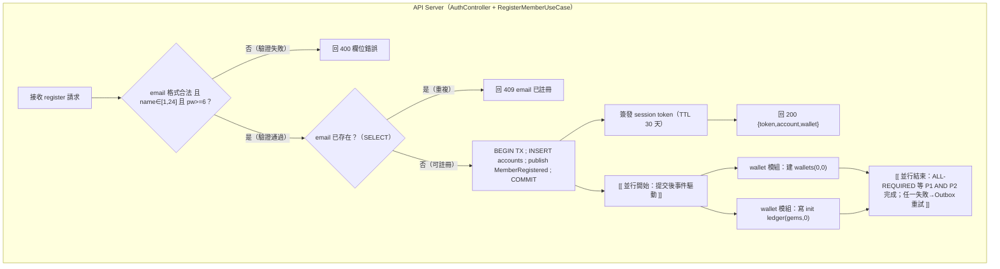

# Activity Diagram — US-MEM-001 register 系統流程（含並行副作用）

> 來源：EDD.md §4.5.7.2

```mermaid
flowchart TD
    subgraph API ["API Server（AuthController + RegisterMemberUseCase）"]
        A1["接收 register 請求"]
        A2{"email 格式合法 且 name∈[1,24] 且 pw>=6？"}
        A3{"email 已存在？（SELECT）"}
        A4["BEGIN TX ; INSERT accounts ; publish MemberRegistered ; COMMIT"]
        F1["[[ 並行開始：提交後事件驅動 ]]"]
        P1["wallet 模組：建 wallets(0,0)"]
        P2["wallet 模組：寫 init ledger(gems,0)"]
        J1["[[ 並行結束：ALL-REQUIRED 等 P1 AND P2 完成；任一失敗→Outbox 重試 ]]"]
        A5["簽發 session token（TTL 30 天）"]
        R400["回 400 欄位錯誤"]
        R409["回 409 email 已註冊"]
        R200["回 200 {token,account,wallet}"]
    end
    A1 --> A2
    A2 -->|"否（驗證失敗）"| R400
    A2 -->|"是（驗證通過）"| A3
    A3 -->|"是（重複）"| R409
    A3 -->|"否（可註冊）"| A4
    A4 --> A5 --> R200
    A4 --> F1 --> P1 --> J1
    F1 --> P2 --> J1
```
