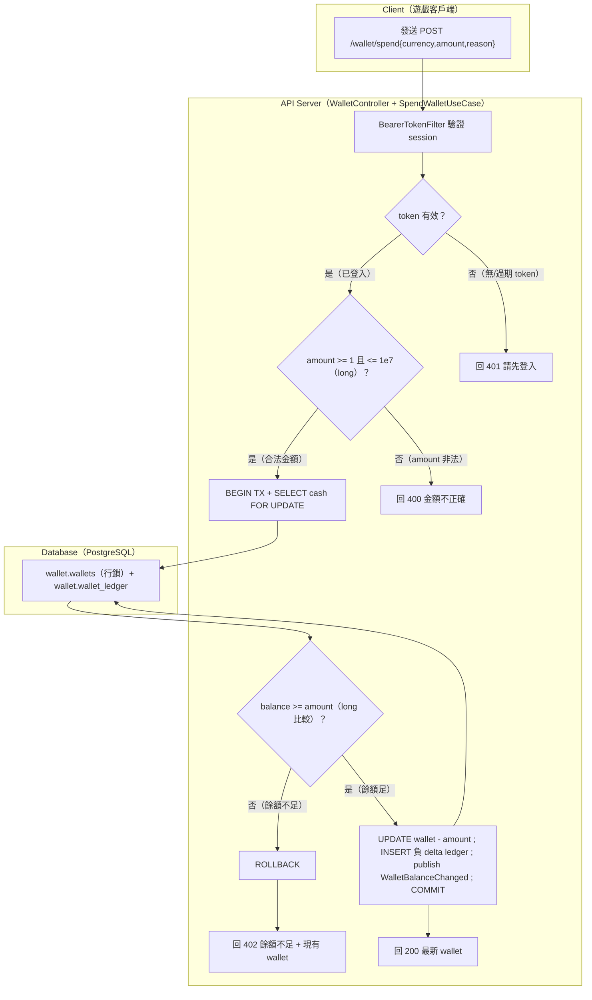

# Activity Diagram — US-WAL-001 spend 主線（泳道 + 決策點）

> 來源：EDD.md §4.5.7.1

```mermaid
flowchart TD
    subgraph Client ["Client（遊戲客戶端）"]
        A1["發送 POST /wallet/spend{currency,amount,reason}"]
    end
    subgraph API ["API Server（WalletController + SpendWalletUseCase）"]
        B1["BearerTokenFilter 驗證 session"]
        B2{"token 有效？"}
        B3{"amount >= 1 且 <= 1e7（long）？"}
        B4["BEGIN TX + SELECT cash FOR UPDATE"]
        B5{"balance >= amount（long 比較）？"}
        B6["UPDATE wallet - amount ; INSERT 負 delta ledger ; publish WalletBalanceChanged ; COMMIT"]
        B7["ROLLBACK"]
        R401["回 401 請先登入"]
        R400["回 400 金額不正確"]
        R402["回 402 餘額不足 + 現有 wallet"]
        R200["回 200 最新 wallet"]
    end
    subgraph DB ["Database（PostgreSQL）"]
        D1["wallet.wallets（行鎖）+ wallet.wallet_ledger"]
    end
    A1 --> B1 --> B2
    B2 -->|"否（無/過期 token）"| R401
    B2 -->|"是（已登入）"| B3
    B3 -->|"否（amount 非法）"| R400
    B3 -->|"是（合法金額）"| B4
    B4 --> D1
    D1 --> B5
    B5 -->|"否（餘額不足）"| B7 --> R402
    B5 -->|"是（餘額足）"| B6 --> D1
    B6 --> R200
```
