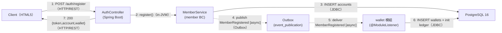

# Communication Diagram — 註冊事件驅動協作

> 來源：EDD.md §4.5.5

```mermaid
flowchart LR
    Client["Client（HTML5）"]
    Auth["AuthController<br/>(Spring Boot)"]
    Member["MemberService<br/>(member BC)"]
    Outbox["Outbox<br/>(event_publication)"]
    Wallet["wallet 模組<br/>(@ModuleListener)"]
    DB["PostgreSQL 16"]

    Client -->|"1: POST /auth/register（HTTP/REST）"| Auth
    Auth -->|"2: register()（in-JVM）"| Member
    Member -->|"3: INSERT accounts（JDBC）"| DB
    Member -.->|"4: publish MemberRegistered [async]（Outbox）"| Outbox
    Outbox -.->|"5: deliver MemberRegistered [async]"| Wallet
    Wallet -->|"6: INSERT wallets + init ledger（JDBC）"| DB
    Auth -->|"7: 200 {token,account,wallet}（HTTP/REST）"| Client
```

> 本系統模組間非同步通訊透過 Spring Modulith Event Publication Registry（Outbox）；同步跨 BC（entitlement→wallet）為 in-JVM Public API 呼叫。
