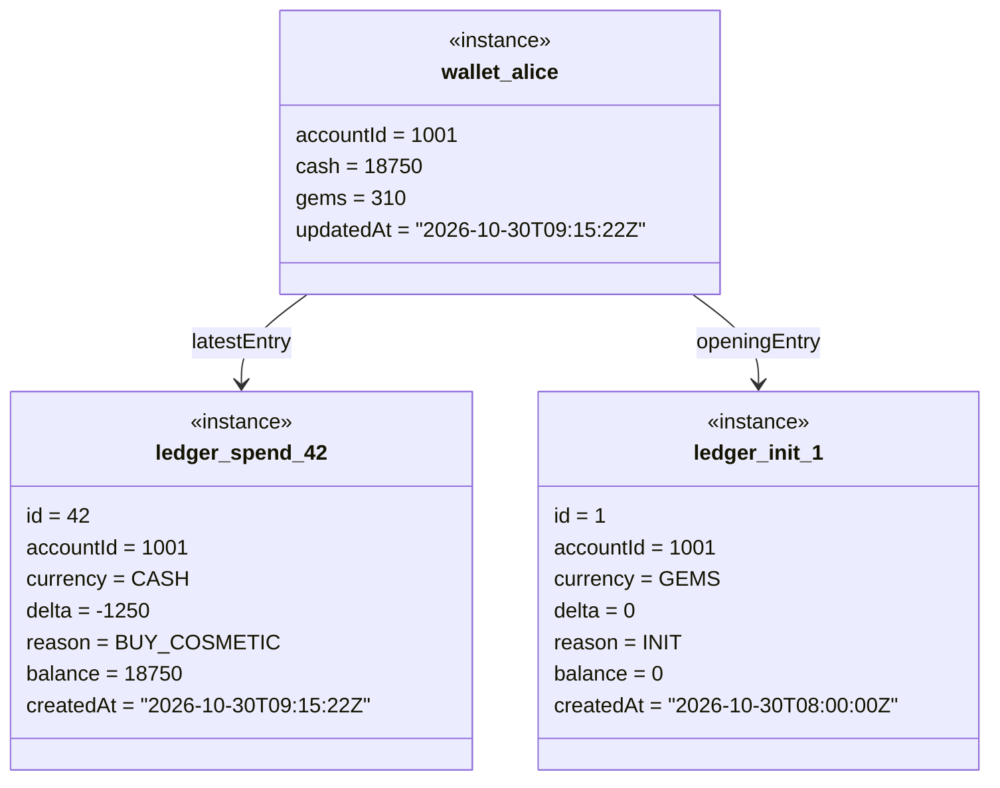
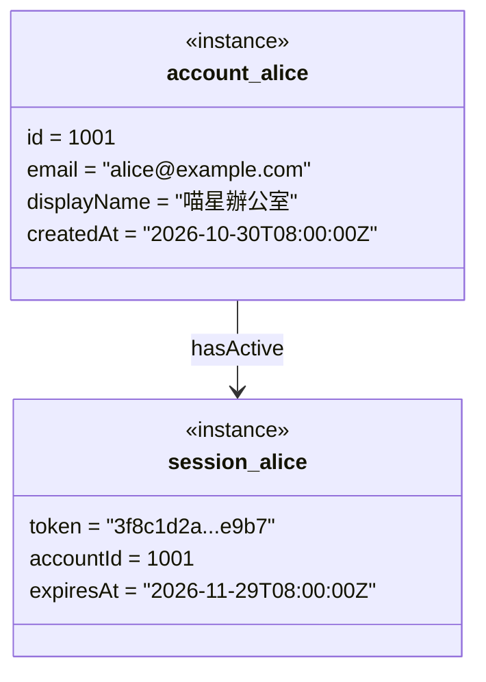

# Object Diagram — 執行時實例快照

> 來源：EDD.md §4.5.3

## （1）Wallet — 扣款後狀態實例

```mermaid
classDiagram
    class wallet_alice {
        <<instance>>
        accountId = 1001
        cash = 18750
        gems = 310
        updatedAt = "2026-10-30T09:15:22Z"
    }
    class ledger_spend_42 {
        <<instance>>
        id = 42
        accountId = 1001
        currency = CASH
        delta = -1250
        reason = BUY_COSMETIC
        balance = 18750
        createdAt = "2026-10-30T09:15:22Z"
    }
    class ledger_init_1 {
        <<instance>>
        id = 1
        accountId = 1001
        currency = GEMS
        delta = 0
        reason = INIT
        balance = 0
        createdAt = "2026-10-30T08:00:00Z"
    }
    wallet_alice --> ledger_spend_42 : latestEntry
    wallet_alice --> ledger_init_1 : openingEntry
```

## （2）Account — 已登入狀態實例

```mermaid
classDiagram
    class account_alice {
        <<instance>>
        id = 1001
        email = "alice@example.com"
        displayName = "喵星辦公室"
        createdAt = "2026-10-30T08:00:00Z"
    }
    class session_alice {
        <<instance>>
        token = "3f8c1d2a...e9b7"
        accountId = 1001
        expiresAt = "2026-11-29T08:00:00Z"
    }
    account_alice --> session_alice : hasActive
```
