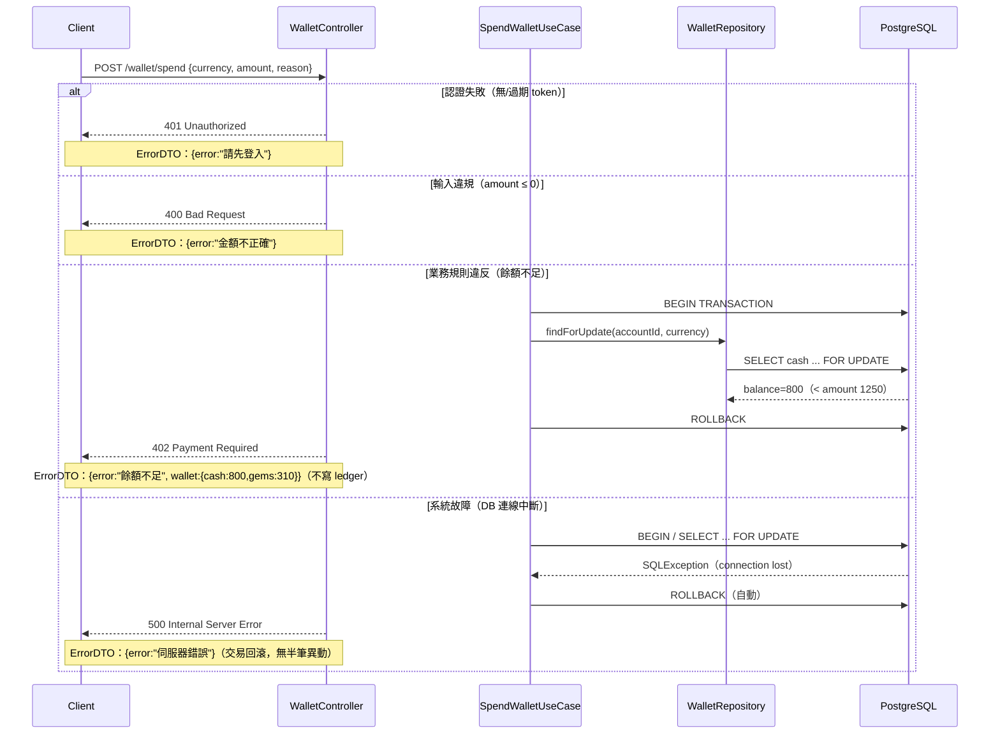

# Sequence Diagram — `POST /wallet/spend` Error Paths（3 類）

> 來源：EDD.md §4.5.4.2

```mermaid
sequenceDiagram
    participant Client as Client
    participant Ctrl as WalletController
    participant UC as SpendWalletUseCase
    participant Repo as WalletRepository
    participant DB as PostgreSQL

    Client->>Ctrl: POST /wallet/spend {currency, amount, reason}
    alt 認證失敗（無/過期 token）
        Ctrl-->>Client: 401 Unauthorized
        Note over Ctrl,Client: ErrorDTO：{error:"請先登入"}
    else 輸入違規（amount ≤ 0）
        Ctrl-->>Client: 400 Bad Request
        Note over Ctrl,Client: ErrorDTO：{error:"金額不正確"}
    else 業務規則違反（餘額不足）
        UC->>DB: BEGIN TRANSACTION
        UC->>Repo: findForUpdate(accountId, currency)
        Repo->>DB: SELECT cash ... FOR UPDATE
        DB-->>Repo: balance=800（< amount 1250）
        UC->>DB: ROLLBACK
        Ctrl-->>Client: 402 Payment Required
        Note over Ctrl,Client: ErrorDTO：{error:"餘額不足", wallet:{cash:800,gems:310}}（不寫 ledger）
    else 系統故障（DB 連線中斷）
        UC->>DB: BEGIN / SELECT ... FOR UPDATE
        DB-->>UC: SQLException（connection lost）
        UC->>DB: ROLLBACK（自動）
        Ctrl-->>Client: 500 Internal Server Error
        Note over Ctrl,Client: ErrorDTO：{error:"伺服器錯誤"}（交易回滾，無半筆異動）
    end
```
